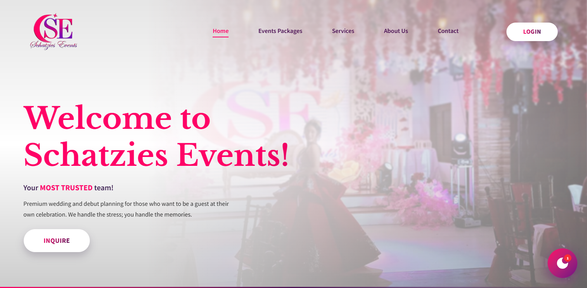

# Schatzeis Events Client and Events Management System

This system has two connected subsystems: **G1 (Client Side System)** for client-facing features like website access, event plan viewing, RSVP QR, and organizer chat; and **G2 (Organizer Side System)** for organizer/admin operations like planning, resource and event management, RSVP monitoring/scanning, and budget tracking.

## Tech Stack

- **Frontend:** React + TypeScript
- **Backend:** Express.js serverless API running on AWS Lambda
- **Database:** AWS DynamoDB (NoSQL)

## Hosted on AWS

- AWS Lambda (Express.js serverless runtime)
- S3 Bucket
- DynamoDB
- API Gateway
- GitHub Actions (CI/CD)
- AWS Lambda (Express)
- S3 Bucket
- DynamoDB
- API Gateway
- GitHub Actions (CI/CD)
- CloudFront
- CloudFormation
- IAM

## License

This project is licensed under the MIT License. See `LICENSE.md` for full terms.